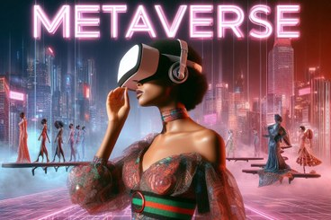

# Fashion-in-The-Metaverse-Tutorial

[Speaker: Lorenzo Stacchio](https://lorenzo-stacchio.github.io/) | [Virtual And Augmented Reality lab](https://site.unibo.it/varlab/en) | [IFIP/ICEC conference](https://icec23.cs.unibo.it/) | [Home page](https://site.unibo.it/varlab/en/dissemination-2/fashion-in-the-metaverse-technologies-applications-and-opportunities-ifip-icec-2023-tutorial)

  

Material for the "Fashion in the Metaverse: Technologies, Applications, and Opportunities" tutorial presented at IFIP ICEC 2023.

This tutorial will provide participants with an overview of how academia and industry are applying Metaverse-related technologies to the entertainment sector, with an emphasis on fashion. Fashion, in fact, appears as an interesting use case, as it integrates:

* Entertainment and storytelling aspects;
* Creativity;
* Industrial production;
* Large customer bases.
 
In the last three decades, different research products and experiences have been proposed based on eXtended reality technologies, but the advent of a Metaverse ecosystem deploying non-fungible tokens, artificial intelligence paradigms, and advanced interfaces is opening completely new scenarios.

The material will be presented adopting a methodological approach, proposing taxonomies and analyses that connect to consumer needs, use cases, hardware technologies, and software architectures. The target audience that would most benefit from this tutorial would be entertainment professionals in academia and industry, with a particular interest in cultural heritage preservation, creative aspects, brand identity, and Commerce.

By the end of this tutorial, an attendee could develop a drafted project proposal for future funding applications or outline a research and development agenda.

## Demos
### Generative AI
* Stable Diffusion for Text-To-Image generation --> 
  
* ControlNet + Segment Anything Shoes generation -->

  

### eXtended Reality

* [Cloth Simulation with Unity](eXtended_Reality/Cloth_Unity_Demo/) --> Requires Unity 2021.3.x

* [Commercial AR Shoes Try-On](https://play.google.com/store/apps/details?id=com.wearfits.objectdetection&hl=it&gl=US) --> [Android](https://play.google.com/store/apps/details?id=com.wearfits.objectdetection&hl=it&gl=US) | [iOS](https://apps.apple.com/it/app/wanna-kicks/id1444049305)

## References included and discussed in the presentation (thanks to [Selenium ❤️](https://github.com/SeleniumHQ/selenium))

* [[1] Dwivedi, Y. K., Hughes, L., Baabdullah, A. M., Ribeiro-Navarrete, S., Giannakis, M., Al-Debei, M. M., ...  Wamba, S. F. (2022). Metaverse beyond the hype: Multidisciplinary perspectives on emerging challenges, opportunities, and agenda for research, practice and policy. International Journal of Information Management, 66, 102542.](https://www.sciencedirect.com/science/article/pii/S0268401222000767)
* [[1a] Faria, A. P.,  Cunha, J. (2023, July). Extended reality (XR) in the digital fashion landscape. In International Conference on Fashion communication: between tradition and future digital developments (pp. 49-56). Cham: Springer Nature Switzerland.](https://link.springer.com/chapter/10.1007/978-3-031-38541-4_5)
* [[1b] Baek, E., Haines, S., Fares, O. H., Huang, Z., Hong, Y.,  Lee, S. H. M. (2022). Defining digital fashion: Reshaping the field via a systematic review. Computers in Human Behavior, 107407.](https://www.sciencedirect.com/science/article/pii/S0747563222002291)
* [[1c] Mu, X., Zhang, H., Shi, J., Hou, J., Ma, J.,  Yang, Y. (2023). Fashion Intelligence in the Metaverse: Promise and Future Prospects.](https://www.researchsquare.com/article/rs-2594075/latest)
* [[2] Damar, M. (2021). Metaverse shape of your life for future: A bibliometric snapshot. Journal of Metaverse, 1(1), 1-8.](https://dergipark.org.tr/en/pub/jmv/issue/67581/1051371)
* [[3] Wang, Y., Su, Z., Zhang, N., Xing, R., Liu, D., Luan, T. H.,  Shen, X. (2022). A survey on metaverse: Fundamentals, security, and privacy. IEEE Communications Surveys  Tutorials.](https://ieeexplore.ieee.org/abstract/document/9880528/)
* [[4] Iop, A., El-Hajj, V. G., Gharios, M., de Giorgio, A., Monetti, F. M., Edström, E., ...  Romero, M. (2022). Extended reality in neurosurgical education: A systematic review. Sensors, 22(16), 6067.](https://www.mdpi.com/1424-8220/22/16/6067)
* [[5] Speicher, M., Hall, B. D.,  Nebeling, M. (2019, May). What is mixed reality?. In Proceedings of the 2019 CHI conference on human factors in computing systems (pp. 1-15).](https://dl.acm.org/doi/abs/10.1145/3290605.3300767)
* [[6] Mogaji, E., Dwivedi, Y. K.,  Raman, R. (2023). Fashion marketing in the metaverse. Journal of Global Fashion Marketing, 1-16.](https://www.tandfonline.com/doi/abs/10.1080/20932685.2023.2249483)
* [[7] Loureiro, S. M. C. (2023). Artificial Intelligence and Extended Reality in Luxury Fashion Retail: Analysis and Reflection. In Augmented Reality and Artificial Intelligence: The Fusion of Advanced Technologies (pp. 323-348). Cham: Springer Nature Switzerland.](https://link.springer.com/chapter/10.1007/978-3-031-27166-3_18)
* [[8] Qayyum, A., Butt, M. A., Ali, H., Usman, M., Halabi, O., Al-Fuqaha, A., ...  Qadir, J. (2022). Secure and trustworthy artificial intelligence-extended reality (AI-XR) for metaverses. arXiv preprint arXiv:2210.13289.](https://arxiv.org/abs/2210.13289)
* [[9] Cheng, W. H., Song, S., Chen, C. Y., Hidayati, S. C.,  Liu, J. (2021). Fashion meets computer vision: A survey. ACM Computing Surveys (CSUR), 54(4), 1-41.](https://dl.acm.org/doi/abs/10.1145/3447239)
* [[10] Ge, Y., Zhang, R., Wang, X., Tang, X.,  Luo, P. (2019). Deepfashion2: A versatile benchmark for detection, pose estimation, segmentation and re-identification of clothing images. In Proceedings of the IEEE/CVF conference on computer vision and pattern recognition (pp. 5337-5345).](http://openaccess.thecvf.com/content_CVPR_2019/html/Ge_DeepFashion2_A_Versatile_Benchmark_for_Detection_Pose_Estimation_Segmentation_and_CVPR_2019_paper.html)
* [[11] Wieczorek, M., Rychalska, B.,  Dąbrowski, J. (2021). On the unreasonable effectiveness of centroids in image retrieval. In Neural Information Processing: 28th International Conference, ICONIP 2021, Sanur, Bali, Indonesia, December 8–12, 2021, Proceedings, Part IV 28 (pp. 212-223). Springer International Publishing.](https://link.springer.com/chapter/10.1007/978-3-030-92273-3_18)
* [[12] He, S., Song, Y. Z.,  Xiang, T. (2022). Style-based global appearance flow for virtual try-on. In Proceedings of the IEEE/CVF Conference on Computer Vision and Pattern Recognition (pp. 3470-3479).](http://openaccess.thecvf.com/content/CVPR2022/html/He_Style-Based_Global_Appearance_Flow_for_Virtual_Try-On_CVPR_2022_paper.html)
* [[13] Zhu, H., Cao, Y., Jin, H., Chen, W., Du, D., Wang, Z., ...  Han, X. (2020). Deep fashion3d: A dataset and benchmark for 3d garment reconstruction from single images. In Computer Vision–ECCV 2020: 16th European Conference, Glasgow, UK, August 23–28, 2020, Proceedings, Part I 16 (pp. 512-530). Springer International Publishing.](https://link.springer.com/chapter/10.1007/978-3-030-58452-8_30)
* [[14] Hong, F., Chen, Z., Lan, Y., Pan, L.,  Liu, Z. (2022). Eva3d: Compositional 3d human generation from 2d image collections. arXiv preprint arXiv:2210.04888.](https://arxiv.org/abs/2210.04888)
* [[15] Zhao, F., Xie, Z., Kampffmeyer, M., Dong, H., Han, S., Zheng, T., ...  Liang, X. (2021). M3d-vton: A monocular-to-3d virtual try-on network. In Proceedings of the IEEE/CVF International Conference on Computer Vision (pp. 13239-13249).](http://openaccess.thecvf.com/content/ICCV2021/html/Zhao_M3D-VTON_A_Monocular-to-3D_Virtual_Try-On_Network_ICCV_2021_paper.html)
* [[16] Baldrati, A., Bertini, M., Uricchio, T.,  Del Bimbo, A. (2021). Conditioned image retrieval for fashion using contrastive learning and CLIP-based features. In ACM Multimedia Asia (pp. 1-5).](https://dl.acm.org/doi/abs/10.1145/3469877.3493593)
* [[17] Radford, A., Kim, J. W., Hallacy, C., Ramesh, A., Goh, G., Agarwal, S., ...  Sutskever, I. (2021, July). Learning transferable visual models from natural language supervision. In International conference on machine learning (pp. 8748-8763). PMLR.](http://proceedings.mlr.press/v139/radford21a)
* [[18] Zhang, H., Jiang, S.,  Fu, Y. (2021, December). Stylized Text-to-Fashion Image Generation. In 2021 16th IEEE International Conference on Automatic Face and Gesture Recognition (FG 2021) (pp. 1-8). IEEE.](https://ieeexplore.ieee.org/abstract/document/9667042/)
* [[19] Rombach, R., Blattmann, A., Lorenz, D., Esser, P.,  Ommer, B. (2022). High-resolution image synthesis with latent diffusion models. In Proceedings of the IEEE/CVF conference on computer vision and pattern recognition (pp. 10684-10695).](http://openaccess.thecvf.com/content/CVPR2022/html/Rombach_High-Resolution_Image_Synthesis_With_Latent_Diffusion_Models_CVPR_2022_paper.html)
* [[20] Christodoulou, K., Katelaris, L., Themistocleous, M., Christodoulou, P.,  Iosif, E. (2022). NFTs and the metaverse revolution: research perspectives and open challenges. Blockchains and the Token Economy: Theory and Practice, 139-178.](https://link.springer.com/chapter/10.1007/978-3-030-95108-5_6)
* [[21] Karras, J., Holynski, A., Wang, T. C.,  Kemelmacher-Shlizerman, I. (2023). Dreampose: Fashion image-to-video synthesis via stable diffusion. arXiv preprint arXiv:2304.06025.](https://arxiv.org/abs/2304.06025)
* [[22] Song, W., Gong, Y.,  Wang, Y. (2022, October). VTONShoes: Virtual Try-on of Shoes in Augmented Reality on a Mobile Device. In 2022 IEEE International Symposium on Mixed and Augmented Reality (ISMAR) (pp. 234-242). IEEE.](https://ieeexplore.ieee.org/abstract/document/9995693/)
* [[23] Tao, X., Chen, X., Zeng, X.,  Koehl, L. (2018). A customized garment collaborative design process by using virtual reality and sensory evaluation on garment fit. Computers  Industrial Engineering, 115, 683-695.](https://www.sciencedirect.com/science/article/pii/S0360835217305089)
* [[24] Morotti, E., Stacchio, L., Donatiello, L., Roccetti, M., Tarabelli, J.,  Marfia, G. (2022). Exploiting fashion x-commerce through the empowerment of voice in the fashion virtual reality arena: Integrating voice assistant and virtual reality technologies for fashion communication. Virtual Reality, 1-14.](https://link.springer.com/article/10.1007/s10055-021-00602-6)
* [[25] Stacchio, L., Perlino, M., Vagnoni, U., Sasso, F., Scorolli, C.,  Marfia, G. (2022, March). Who will trust my digital twin? maybe a clerk in a brick and mortar fashion shop. In 2022 IEEE Conference on Virtual Reality and 3D User Interfaces Abstracts and Workshops (VRW) (pp. 814-815). IEEE.](https://ieeexplore.ieee.org/abstract/document/9757522/)
* [[26] Luce, L. (2018). Artificial intelligence for fashion: How AI is revolutionizing the fashion industry. Apress.](https://books.google.com/books?hl=it&lr=&id=ZRF-DwAAQBAJ&oi=fnd&pg=PR5&dq=+Luce,+L.+(2018).+Artificial+intelligence+for+fashion:+How+AI+is+revolutionizing+the+fashion+industry.+Apress.&ots=rKxv38EVhZ&sig=BCGsQZS-rYAUcLp6HfauQRPzSkc)
* [[27] Li, K., Cui, Y., Li, W., Lv, T., Yuan, X., Li, S., ...  Dressler, F. (2022). When internet of things meets metaverse: Convergence of physical and cyber worlds. IEEE Internet of Things Journal, 10(5), 4148-4173.](https://ieeexplore.ieee.org/abstract/document/10002946/)
* [[28] Shengli, W. (2021). Is human digital twin possible?. Computer Methods and Programs in Biomedicine Update, 1, 100014.](https://www.sciencedirect.com/science/article/pii/S2666990021000136)
* [[29] Barricelli, B. R., Casiraghi, E.,  Fogli, D. (2019). A survey on digital twin: Definitions, characteristics, applications, and design implications. IEEE access, 7, 167653-167671.](https://ieeexplore.ieee.org/abstract/document/8901113/)
* [[30] Stacchio, L., Angeli, A.,  Marfia, G. (2022). Empowering digital twins with extended reality collaborations. Virtual Reality  Intelligent Hardware, 4(6), 487-505.](https://www.sciencedirect.com/science/article/pii/S2096579622000596)
* [[31] Miller, M. E.,  Spatz, E. (2022). A unified view of a human digital twin. Human-Intelligent Systems Integration, 4(1-2), 23-33.](https://link.springer.com/article/10.1007/s42454-022-00041-x)
* [[32] Hou, S., Wang, Y., Ning, B.,  Liang, W. (2021, March). Climaxing vr character with scene-aware aesthetic dress synthesis. In 2021 IEEE Virtual Reality and 3D User Interfaces (VR) (pp. 57-64). IEEE.](https://ieeexplore.ieee.org/abstract/document/9417796/)
* [[33] dos Santos, C. H., Gabriel, G. T., do Amaral, J. V. S., Montevechi, J. A. B.,  de Queiroz, J. A. (2021). Decision-making in a fast fashion company in the Industry 4.0 era: A Digital Twin proposal to support operational planning. The International Journal of Advanced Manufacturing Technology, 116, 1653-1666.](https://link.springer.com/article/10.1007/s00170-021-07543-z)
* [[34] Fu, Y.,  Li, Y. (2023, June). Hanfu AR: Digital Twins of Traditional Chinese Costumes for Augmented Reality Try-On Systems. In 2023 IEEE 47th Annual Computers, Software, and Applications Conference (COMPSAC) (pp. 1465-1470). IEEE.](https://ieeexplore.ieee.org/abstract/document/10196850/)
* [[35] Joy, A., Zhu, Y., Peña, C.,  Brouard, M. (2022). Digital future of luxury brands: Metaverse, digital fashion, and non‐fungible tokens. Strategic change, 31(3), 337-343.](https://onlinelibrary.wiley.com/doi/abs/10.1002/jsc.2502)
* [[36] Lin, C. H., Gao, J., Tang, L., Takikawa, T., Zeng, X., Huang, X., ...  Lin, T. Y. (2023). Magic3d: High-resolution text-to-3d content creation. In Proceedings of the IEEE/CVF Conference on Computer Vision and Pattern Recognition (pp. 300-309).](http://openaccess.thecvf.com/content/CVPR2023/html/Lin_Magic3D_High-Resolution_Text-to-3D_Content_Creation_CVPR_2023_paper.html)
* [[37] Zhang, L., Rao, A.,  Agrawala, M. (2023). Adding conditional control to text-to-image diffusion models. In Proceedings of the IEEE/CVF International Conference on Computer Vision (pp. 3836-3847).](http://openaccess.thecvf.com/content/ICCV2023/html/Zhang_Adding_Conditional_Control_to_Text-to-Image_Diffusion_Models_ICCV_2023_paper.html)
* [[38] Kirillov, A., Mintun, E., Ravi, N., Mao, H., Rolland, C., Gustafson, L., ...  Girshick, R. (2023). Segment anything. arXiv preprint arXiv:2304.02643.](https://arxiv.org/abs/2304.02643)
* [[39] Stemasov, E., Wagner, T., Gugenheimer, J.,  Rukzio, E. (2022, April). ShapeFindAR: Exploring in-situ spatial search for physical artifact retrieval using mixed reality. In Proceedings of the 2022 CHI Conference on Human Factors in Computing Systems (pp. 1-12).](https://dl.acm.org/doi/abs/10.1145/3491102.3517682)
* [[40] Prato, G., Sallemi, F., Cremonesi, P., Scriminaci, M., Gudmundsson, S.,  Palumbo, S. (2020, April). Outfit completion and clothes recommendation. In Extended Abstracts of the 2020 CHI Conference on Human Factors in Computing Systems (pp. 1-7).](https://dl.acm.org/doi/abs/10.1145/3334480.3383076)
* [[41] Cui, A., McKee, D.,  Lazebnik, S. (2021). Dressing in order: Recurrent person image generation for pose transfer, virtual try-on and outfit editing. In Proceedings of the IEEE/CVF international conference on computer vision (pp. 14638-14647).](http://openaccess.thecvf.com/content/ICCV2021/html/Cui_Dressing_in_Order_Recurrent_Person_Image_Generation_for_Pose_Transfer_ICCV_2021_paper.html)
* [[42] Weiss, C. (2022). Fashion retailing in the metaverse. Fashion, Style  Popular Culture, 9(4), 523-538.](https://intellectdiscover.com/content/journals/10.1386/fspc_00159_1)
* [[43] Oussidi, A.,  Elhassouny, A. (2018, April). Deep generative models: Survey. In 2018 International conference on intelligent systems and computer vision (ISCV) (pp. 1-8). IEEE.](https://ieeexplore.ieee.org/abstract/document/8354080/)
* [[44] Yuan, C.,  Moghaddam, M. (2020). Garment design with generative adversarial networks. arXiv preprint arXiv:2007.10947.](https://arxiv.org/abs/2007.10947)
* [[45] Croitoru, F. A., Hondru, V., Ionescu, R. T.,  Shah, M. (2023). Diffusion models in vision: A survey. IEEE Transactions on Pattern Analysis and Machine Intelligence.](https://ieeexplore.ieee.org/abstract/document/10081412/)
* [[46] Sun, Z., Zhou, Y., He, H.,  Mok, P. Y. (2023, October). SGDiff: A Style Guided Diffusion Model for Fashion Synthesis. In Proceedings of the 31st ACM International Conference on Multimedia (pp. 8433-8442).](https://dl.acm.org/doi/abs/10.1145/3581783.3613806)
* [[47] Xing, X., Felder, F., Nan, Y., Papanastasiou, G., Simon, W.,  Yang, G. (2023). You Don't Have to Be Perfect to Be Amazing: Unveil the Utility of Synthetic Images. arXiv preprint arXiv:2305.18337.](https://arxiv.org/abs/2305.18337)
* [[48] Karras, J., Holynski, A., Wang, T. C.,  Kemelmacher-Shlizerman, I. (2023). Dreampose: Fashion image-to-video synthesis via stable diffusion. arXiv preprint arXiv:2304.06025.](https://arxiv.org/abs/2304.06025)
* [[49] Digital 3D FashionDesigners: Casesof Atacac andThe Fabricant](https://www.tandfonline.com/doi/abs/10.1080/1362704X.2021.1981657)
* [[50] Zhang, X., Yang, B., Kampffmeyer, M. C., Zhang, W., Zhang, S., Lu, G., ...  Liang, X. (2023). DiffCloth: Diffusion Based Garment Synthesis and Manipulation via Structural Cross-modal Semantic Alignment. In Proceedings of the IEEE/CVF International Conference on Computer Vision (pp. 23154-23163).](http://openaccess.thecvf.com/content/ICCV2023/html/Zhang_DiffCloth_Diffusion_Based_Garment_Synthesis_and_Manipulation_via_Structural_Cross-modal_ICCV_2023_paper.html)
* [[51] Oechsle, M., Mescheder, L., Niemeyer, M., Strauss, T.,  Geiger, A. (2019). Texture fields: Learning texture representations in function space. In Proceedings of the IEEE/CVF International Conference on Computer Vision (pp. 4531-4540).](http://openaccess.thecvf.com/content_ICCV_2019/html/Oechsle_Texture_Fields_Learning_Texture_Representations_in_Function_Space_ICCV_2019_paper.html)
* [[52] Stacchio, L., Scorolli, C.,  Marfia, G. (2022). Evaluating Human Aesthetic and Emotional Aspects of 3D generated content through eXtended Reality.](https://www.researchgate.net/profile/Lorenzo-Stacchio/publication/375089750_Evaluating_Human_Aesthetic_and_Emotional_Aspects_of_3D_generated_content_through_eXtended_Reality/links/6540b711ff8d8f507cda56b3/Evaluating-Human-Aesthetic-and-Emotional-Aspects-of-3D-generated-content-through-eXtended-Reality.pdf)
* [[53] Scorolli, C., Grasso, E. N., Stacchio, L., Armandi, V., Matteucci, G.,  Marfia, G. (2023). “Would you rather come to a tango concert in theater or in VR? Aesthetic emotions  social presence in musical experiences, either live, 2D or 3D.” Computers in Human Behavior.](https://www.sciencedirect.com/science/article/pii/S0747563223002613)
* [[54] Feng, R. (2020, December). To Become Fashionable: A Brief Review of Outfit Compatibility. In 2020 IEEE Conference on Telecommunications, Optics and Computer Science (TOCS) (pp. 219-225). IEEE.](https://ieeexplore.ieee.org/abstract/document/9339690/)
* [[55] Lu, Z., Hu, Y., Chen, Y.,  Zeng, B. (2021). Personalized outfit recommendation with learnable anchors. In Proceedings of the IEEE/CVF conference on computer vision and pattern recognition (pp. 12722-12731).](http://openaccess.thecvf.com/content/CVPR2021/html/Lu_Personalized_Outfit_Recommendation_With_Learnable_Anchors_CVPR_2021_paper.html)
* [[56] Wang, T., Kanakis, M., Schindler, K., Van Gool, L.,  Obukhov, A. (2023). Breathing New Life into 3D Assets with Generative Repainting. arXiv preprint arXiv:2309.08523.](https://arxiv.org/abs/2309.08523)

